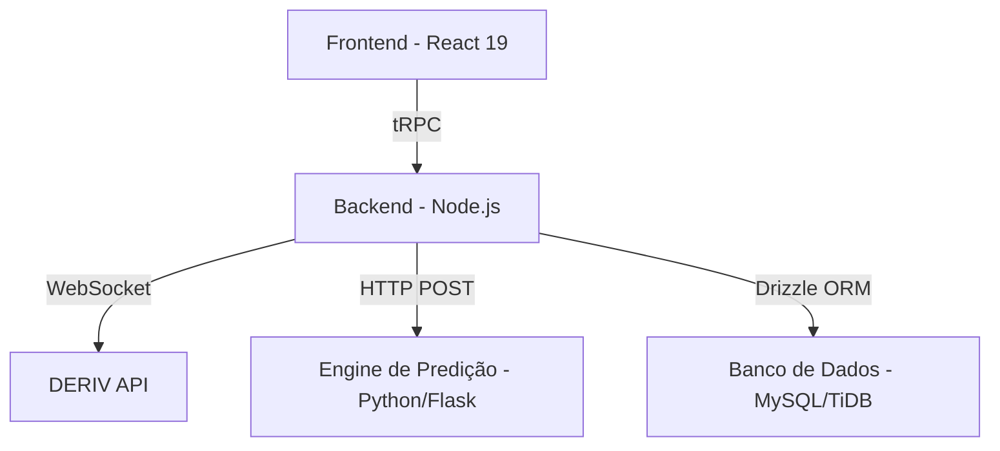

# Análise Completa do Projeto: Schimidt Trader System PRO

**Data da Análise**: 04 de Novembro de 2025
**Analista**: Manus AI

## 1. Visão Geral do Projeto

O **Schimidt Trader System PRO** é uma plataforma de trading automatizado, projetada para operar 24/7 nos ativos sintéticos da plataforma **DERIV**. O núcleo do sistema é uma **engine de predição proprietária**, baseada no algoritmo "Fibonacci da Amplitude", que, segundo a documentação, possui uma assertividade de **84.85%** na previsão do fechamento de velas de 15 minutos (M15).

### 1.1. Objetivos Principais

- **Automação Completa**: Executar operações de trading sem a necessidade de intervenção humana.
- **Alta Assertividade**: Utilizar um algoritmo proprietário para maximizar a taxa de acerto das operações.
- **Gestão de Risco**: Implementar mecanismos de controle de perdas e ganhos, como stop/take diário e fechamento antecipado de posições.
- **Interface Intuitiva**: Fornecer um dashboard em tempo real para que o usuário possa monitorar o desempenho do bot, as operações e as configurações.

## 2. Arquitetura do Sistema

A plataforma é construída sobre uma arquitetura de três camadas principais: um frontend em React, um backend em Node.js e um microsserviço de predição em Python.

| Camada | Tecnologia Principal | Responsabilidades |
| :--- | :--- | :--- |
| **Frontend** | React 19, TypeScript, Vite | Dashboard, visualização de gráficos, configurações, logs. |
| **Backend** | Node.js 22, Express, tRPC | Lógica do bot, gestão de estado, comunicação com a DERIV e com a engine de predição, persistência de dados. |
| **Engine de Predição** | Python 3.11, Flask | Execução do algoritmo "Fibonacci da Amplitude" e fornecimento de predições de fechamento de velas. |
| **Banco de Dados** | MySQL/TiDB, Drizzle ORM | Armazenamento de usuários, configurações, candles, posições, métricas e logs. |

## 3. Análise do Código-Fonte

O projeto possui aproximadamente **15.680 linhas de código** (TypeScript e Python) e está bem estruturado, com uma separação clara entre as responsabilidades do frontend, backend e engine de predição.

### 3.1. Frontend (`/client`)

- **Framework**: React 19 com Vite.
- **Linguagem**: TypeScript.
- **UI**: Utiliza **shadcn/ui** para componentes e **Tailwind CSS** para estilização.
- **Comunicação com Backend**: Exclusivamente via **tRPC**, o que garante type-safety entre o cliente e o servidor.
- **Componentes Chave**:
    - `Dashboard.tsx`: Tela principal que exibe o status do bot, métricas de PnL, gráfico de velas e posições.
    - `CandleChart.tsx`: Componente de gráfico (usando **Recharts**) que renderiza as velas M15 em tempo real.
    - `Settings.tsx`: Página de configuração onde o usuário insere tokens da DERIV, define stake, stop/take, etc.

### 3.2. Backend (`/server`)

- **Runtime**: Node.js 22.
- **Framework**: Express com um servidor tRPC.
- **Lógica Principal**:
    - `tradingBot.ts`: O coração do sistema. Esta classe gerencia o ciclo de vida do bot, os estados (ex: `COLLECTING`, `PREDICTING`, `ARMED`), a coleta de dados, a execução de ordens e a gestão de risco.
    - `derivService.ts`: Serviço que encapsula toda a comunicação com a API da DERIV via WebSocket, tratando conexão, autenticação, subscrição de ticks e candles, e execução de ordens.
- **Banco de Dados**:
    - `drizzle/schema.ts`: Define a estrutura de todas as tabelas do banco de dados usando o **Drizzle ORM**.
    - `db.ts`: Contém as queries para interagir com o banco de dados.
- **Comunicação com Engine**:
    - `predictionService.ts`: Wrapper TypeScript que faz chamadas HTTP para a engine de predição em Python.

### 3.3. Engine de Predição (`/server/prediction`)

- **Linguagem**: Python 3.11.
- **Framework**: Flask, criando um servidor web local na porta `5070`.
- **Algoritmo**: `prediction_engine.py` contém a implementação do algoritmo **Fibonacci da Amplitude**. Ele analisa a abertura, máxima e mínima de uma vela parcial para prever seu fechamento.
- **API**: Expõe um único endpoint principal, `POST /predict`, que recebe o histórico de candles e a vela parcial atual, e retorna a predição de fechamento e a direção (alta ou baixa).

## 4. Funcionalidades Detalhadas

### 4.1. Lógica de Trading

1.  **Coleta de Dados**: O bot inicia coletando um histórico de 500 velas M15.
2.  **Aguardar Ponto Médio**: A cada nova vela de 15 minutos, o bot aguarda 8 minutos.
3.  **Predição**: Após 8 minutos, ele captura os dados da vela parcial (abertura, máxima, mínima) e os envia para a engine de predição.
4.  **Armar Gatilho**: A engine retorna a predição de fechamento. O bot então calcula um **preço de gatilho** (trigger), que é a predição +/- 16 pontos (offset configurável).
5.  **Entrada**: O bot monitora os ticks em tempo real. Se o preço atual cruzar o gatilho na direção esperada, ele executa uma ordem de `CALL` (compra) ou `PUT` (venda).
6.  **Gestão da Posição**: A posição é monitorada e pode ser fechada antecipadamente se atingir 90% do lucro esperado. Caso contrário, é fechada 20 segundos antes do fim da vela.

### 4.2. Gestão de Risco

- **Stop/Take Diário**: O bot para de operar no dia se atingir um limite de perda (Stop) ou ganho (Take) definido pelo usuário.
- **Uma Operação por Vela**: Para evitar overtrading, o bot realiza no máximo uma operação por vela de 15 minutos.

### 4.3. Sincronização de Dados

O sistema implementa uma **tripla verificação** para garantir a fidelidade dos dados com a API da DERIV, conforme detalhado em `CORRECOES_IMPLEMENTADAS.md`. Os dados são buscados e validados:
1.  No início de cada vela.
2.  No momento da predição.
3.  No fechamento da vela, antes de salvar no banco de dados.

## 5. Estrutura do Banco de Dados

O schema do banco de dados, definido em `drizzle/schema.ts`, é composto pelas seguintes tabelas principais:

- `users`: Informações dos usuários (gerenciado pelo sistema de autenticação da Manus).
- `config`: Configurações do bot para cada usuário (tokens, stake, stop/take, etc.).
- `candles`: Histórico de velas M15 para cada ativo.
- `positions`: Registro de todas as operações (abertas e fechadas).
- `metrics`: Métricas de desempenho agregadas por dia e mês (P&L, total de trades, etc.).
- `eventLogs`: Logs de eventos importantes do sistema para auditoria.
- `botState`: Armazena o estado atual do bot para persistência entre reinicializações.

## 6. Conclusão da Análise

O **Schimidt Trader System PRO** é um sistema de trading automatizado sofisticado e bem arquitetado. A separação clara de responsabilidades, o uso de tecnologias modernas como tRPC e Drizzle, e a implementação de uma engine de predição proprietária como um microsserviço demonstram um design robusto.

A documentação (`README.md`, `DEPLOY_MANUS.md`, etc.) é detalhada e fornece um bom entendimento do funcionamento interno, da configuração e do processo de deploy.

O sistema está pronto para ser estendido, modificado ou utilizado para novas tarefas, dada a clareza de seu código e arquitetura.

**Esta análise foi salva para referência futura.**
