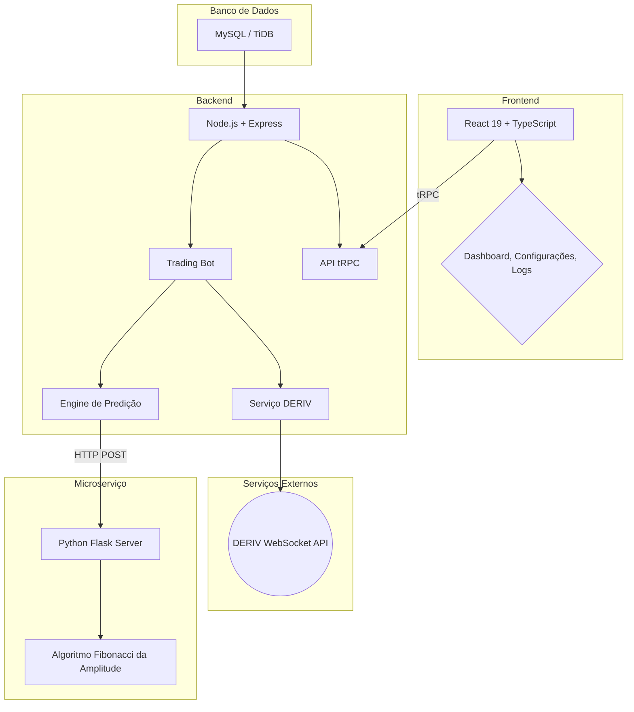

# Análise Detalhada: Schimidt Trader System PRO

**Data da Análise:** 14 de Dezembro de 2025
**Autor:** Manus AI
**Propósito:** Consolidar todo o conhecimento sobre a arquitetura, tecnologias, lógicas e sistemas da plataforma para servir como referência técnica permanente para futuras manutenções, desenvolvimentos e resoluções de problemas.

---

## 1. Visão Geral e Arquitetura

O **Schimidt Trader System PRO** é uma plataforma de trading algorítmico de alta frequência, projetada para operar 24/7 nos mercados de ativos sintéticos da corretora **DERIV**. O núcleo do sistema é uma engine de predição proprietária, baseada no **Algoritmo Fibonacci da Amplitude**, que analisa o comportamento dos candles para prever a direção do mercado e executar operações automaticamente.

A arquitetura é baseada em um modelo de três camadas (three-tier), separando a interface do usuário (frontend), a lógica de negócio (backend) e o armazenamento de dados (banco de dados), com um microserviço adicional para a engine de predição.

### Diagrama da Arquitetura

| Camada | Componente | Descrição |
| :--- | :--- | :--- |
| **Frontend** | Aplicação React (SPA) | Interface de usuário para monitoramento em tempo real, configuração dos bots e visualização de logs e métricas. |
| **Backend** | Servidor Node.js | Orquestra a lógica de negócio, gerencia os bots, processa dados e se comunica com a API da DERIV e a engine de predição. |
| **Microserviço** | Servidor Python Flask | Isola a engine de predição proprietária, expondo-a como um serviço RESTful interno. |
| **Banco de Dados** | MySQL/TiDB | Persiste todas as informações críticas, como configurações, dados de mercado, posições, métricas e logs. |
| **API Externa** | DERIV WebSocket API | Fornece dados de mercado em tempo real (ticks e candles) e permite a execução de ordens de compra e venda. |

---

## 2. Stack Tecnológico

A plataforma utiliza uma combinação de tecnologias modernas e robustas para garantir desempenho, segurança e escalabilidade.

| Categoria | Tecnologia | Versão | Propósito |
| :--- | :--- | :--- | :--- |
| **Frontend** | React | 19 | Construção da interface de usuário. |
| | TypeScript | 5.9.3 | Garante a segurança de tipos no código. |
| | Tailwind CSS | 4.1.14 | Framework de estilização CSS utilitário. |
| | tRPC | 11.6.0 | Criação de APIs type-safe entre frontend e backend. |
| | Recharts | 3.3.0 | Biblioteca para a criação de gráficos dinâmicos. |
| | Wouter | 3.3.5 | Sistema de roteamento minimalista para a SPA. |
| **Backend** | Node.js | 22 | Ambiente de execução para o servidor. |
| | Express | 4.21.2 | Framework web para a criação do servidor e APIs. |
| | Drizzle ORM | 0.44.5 | Mapeamento objeto-relacional para o banco de dados. |
| | WebSocket (ws) | 8.18.3 | Comunicação em tempo real com a API da DERIV. |
| **Engine de Predição** | Python | 3.11 | Linguagem para o microserviço de predição. |
| | Flask | 3.0.0 | Micro-framework para expor a engine como uma API. |
| | NumPy | >=1.25.0 | Biblioteca para computação numérica. |
| **Banco de Dados** | MySQL / TiDB | - | Armazenamento persistente dos dados da aplicação. |
| **Deployment** | Docker | - | Conteinerização da aplicação para portabilidade. |
| | Railway / Manus | - | Plataforma de deployment e infraestrutura. |

---

## 3. Estrutura do Banco de Dados

O esquema do banco de dados é gerenciado pelo Drizzle ORM e é fundamental para a operação do sistema. As tabelas principais são:

- **`users`**: Armazena informações dos usuários e controle de acesso.
- **`config`**: Contém todas as configurações personalizáveis para cada bot de cada usuário, como tokens de API, stake, limites de risco, e parâmetros de estratégias.
- **`candles`**: Guarda o histórico de dados de mercado (OHLC) para cada ativo e timeframe, servindo de base para a engine de predição.
- **`positions`**: Registra todas as operações de trading, tanto as abertas quanto as fechadas, incluindo detalhes da predição, preços e resultado (PnL).
- **`metrics`**: Agrega dados de desempenho (trades, vitórias, derrotas, PnL) em base diária e mensal para relatórios.
- **`eventLogs`**: Log detalhado de todos os eventos importantes do sistema, crucial para auditoria e debugging.
- **`botState`**: Mantém o estado atual de cada bot (ex: `IDLE`, `PREDICTING`, `ARMED`), permitindo a recuperação em caso de reinicialização.
- **`marketConditions`**: Armazena os resultados da análise do `Market Condition Detector`, classificando o mercado como `GREEN`, `YELLOW` ou `RED`.
- **`marketEvents`**: Registra eventos macroeconômicos (notícias) que podem impactar a volatilidade do mercado.

---

## 4. Lógica de Negócio e Sistemas Principais

A plataforma é composta por vários sistemas interconectados que trabalham em conjunto para automatizar o processo de trading.

### 4.1. Trading Bot (`tradingBot.ts`)

É o coração do sistema. Cada instância do bot opera de forma independente para um usuário e uma configuração específica. Seu ciclo de vida é gerenciado por uma máquina de estados:

1.  **`IDLE`**: Estado inicial, aguardando o comando de início.
2.  **`COLLECTING`**: Coleta o histórico de candles necessário para a predição.
3.  **`WAITING_MIDPOINT`**: Aguarda o tempo configurado (`waitTime`) dentro do candle atual antes de fazer a predição (ex: 8 minutos em um candle de 15 min).
4.  **`PREDICTING`**: Envia os dados do candle parcial para a **Engine de Predição**.
5.  **`ARMED`**: Recebe a predição e calcula um preço-gatilho (`trigger`). O bot monitora o preço do ativo e, se o gatilho for atingido, abre a posição (CALL ou PUT).
6.  **`ENTERED` / `MANAGING`**: Posição aberta. O bot monitora a posição, aplicando lógicas de gestão de risco como `Early Close` e a **IA Hedge**.
7.  **`CLOSED`**: A posição foi encerrada (seja por lucro/perda, expiração ou gestão de risco).
8.  **`LOCK_RISK`**: O bot é pausado se atingir o limite de lucro (`takeDaily`) ou perda (`stopDaily`) diário.

### 4.2. Engine de Predição (`prediction_engine.py`)

É um microserviço em Python que implementa o algoritmo proprietário **Fibonacci da Amplitude**. Ele é **stateless**, ou seja, cada predição é uma chamada de API isolada, garantindo consistência.

-   **Entrada**: Recebe um histórico de candles e os dados parciais do candle atual (abertura, máxima, mínima).
-   **Processamento**: 
    -   **Fase 1 (Ativos de baixa volatilidade):** Utiliza uma metodologia de 
descoberta de "chave" para prever o movimento.
    -   **Fase 2 (Ativos de alta volatilidade):** Aplica o algoritmo principal Fibonacci da Amplitude, que calcula o fechamento previsto com base na relação entre a abertura e o ponto médio do candle (`(máxima + mínima) / 2`).
-   **Saída**: Retorna o preço de fechamento previsto, a direção (`up`/`down`), a estratégia utilizada e um score de confiança.

### 4.3. IA Hedge Inteligente (`hedgeStrategy.ts`)

Este módulo atua como uma camada de gestão de risco avançada, abrindo uma segunda posição para proteger ou reforçar a original com base em três estratégias matemáticas:

1.  **Detecção de Reversão**: Se o preço se move fortemente contra a predição original, a IA abre uma posição de *hedge* na direção oposta para mitigar a perda.
2.  **Reforço em Pullback**: Se o preço se move na direção correta, mas recua temporariamente (pullback), a IA abre uma posição de *reforço* na mesma direção, aproveitando um preço de entrada melhor.
3.  **Reversão de Ponta**: Se o candle se estende excessivamente na direção da predição perto do seu final, a IA aposta em uma pequena reversão (exaustão), abrindo uma posição oposta.

### 4.4. Filtro de Horário (`hourlyFilterLogic.ts`)

Permite que o bot opere apenas em horários específicos do dia, considerados mais favoráveis. Possui múltiplos modos:

-   **Presets (`IDEAL`, `COMPATIBLE`, `COMBINED`):** Conjuntos de horários pré-definidos.
-   **`CUSTOM`**: O usuário define manualmente os horários de operação.
-   **`GOLDEN`**: Permite definir até dois "horários de ouro" dentro dos horários permitidos, nos quais o valor da operação (`stake`) é multiplicado por um fator configurável.

### 4.5. Market Condition Detector V2 (`marketConditionDetector.ts`)

Um sistema de análise que roda a cada hora para avaliar o "humor" do mercado. Ele classifica o mercado em três estados:

-   **`GREEN`**: Condições normais, trading permitido.
-   **`YELLOW`**: Condições de cautela, o bot pode operar com risco reduzido.
-   **`RED`**: Condições perigosas (alta volatilidade, notícias importantes), o trading é pausado.

A análise é baseada em critérios técnicos (ATR, tamanho das sombras, spread) e externos (proximidade de notícias de alto impacto).

### 4.6. DojiGuard (`dojiGuard.ts`)

Um filtro de proteção que impede o bot de operar em candles com alta probabilidade de se tornarem um **Doji** (candle de indecisão, onde a abertura e o fechamento são muito próximos). Ele analisa o range (máxima - mínima) e a proporção do corpo do candle em relação ao seu range total para tomar a decisão de bloquear ou não a operação.

---

## 5. Integrações e APIs Externas

A principal integração externa é com a **API da DERIV**, que é consumida através de um cliente WebSocket (`derivService.ts`).

-   **Conexão**: O serviço estabelece uma conexão segura (WSS) e se autentica usando o token do usuário.
-   **Inscrições (Subscriptions)**:
    -   **Ticks**: Inscreve-se para receber atualizações de preço em tempo real para o ativo selecionado, que são usadas para acionar o gatilho de entrada.
    -   **Candles (OHLC)**: Inscreve-se para receber os dados de candles (abertura, máxima, mínima, fechamento) em tempo real, que são usados para alimentar a engine de predição e construir o histórico.
-   **Ações de Trading**:
    -   **`buy`**: Envia a ordem de compra do contrato (CALL ou PUT) quando o gatilho é atingido.
    -   **`sell`**: Envia a ordem de venda antecipada de um contrato (lógica de `Early Close`).
-   **Gerenciamento de Conexão**: O serviço possui lógicas robustas de reconexão automática com delay exponencial e um sistema de `ping/pong` para garantir que a conexão esteja sempre ativa.

---

## 6. Fluxo de Dados e Comunicação

O fluxo de dados entre os componentes é bem definido para garantir a integridade e a performance.

1.  **Frontend ↔ Backend**: A comunicação é feita exclusivamente via **tRPC**. O frontend chama procedimentos no backend de forma type-safe, como se estivesse chamando uma função local. Isso elimina a necessidade de gerenciar endpoints REST, verbos HTTP e serialização de JSON manualmente.

2.  **Backend ↔ Engine de Predição**: O backend (Node.js) se comunica com a engine (Python) através de chamadas **HTTP POST** para o endpoint `/predict` do servidor Flask. Os dados do candle são enviados como JSON, e a predição é recebida da mesma forma.

3.  **Backend ↔ DERIV**: A comunicação é feita via **WebSocket**. O backend envia comandos JSON para a API da DERIV e recebe eventos (ticks, candles, confirmações) de forma assíncrona.

4.  **Backend ↔ Banco de Dados**: A interação com o banco de dados é abstraída pelo **Drizzle ORM**. O código do backend chama funções como `getConfigByUserId` ou `insertPosition`, e o ORM traduz essas chamadas para queries SQL seguras e eficientes.

---

## 7. Deployment e Infraestrutura

A aplicação é projetada para ser implantada em um ambiente de contêineres, utilizando **Docker**.

-   **`Dockerfile`**: O projeto inclui um `Dockerfile` multi-stage que otimiza a imagem final. 
    1.  O primeiro estágio (`builder`) instala todas as dependências e compila o frontend e o backend.
    2.  O segundo estágio (`runtime`) copia apenas os artefatos compilados e as dependências de produção, resultando em uma imagem menor e mais segura. Ele instala tanto o Node.js quanto o Python, criando um ambiente unificado para toda a aplicação.
-   **`Procfile` e `railway.toml`**: Esses arquivos indicam que a plataforma está configurada para deployment em serviços de PaaS (Platform as a Service) como Heroku ou Railway, que automatizam o processo de build e deploy a partir do código-fonte.
-   **Variáveis de Ambiente**: A configuração sensível (como a URL do banco de dados) é gerenciada através de variáveis de ambiente, seguindo as melhores práticas de segurança (The Twelve-Factor App).

---

## 8. Conclusão e Pontos de Atenção

O Schimidt Trader System PRO é uma plataforma de trading complexa e bem arquitetada, com uma clara separação de responsabilidades entre seus componentes. A escolha de tecnologias modernas como tRPC, Drizzle e a arquitetura de microserviço para a predição demonstram um foco em performance, segurança e manutenibilidade.

**Pontos Críticos para Manutenção:**

-   **Engine de Predição**: A lógica do `prediction_engine.py` é o "segredo" do sistema e deve ser tratada como imutável, a menos que uma nova versão do algoritmo seja desenvolvida e validada.
-   **`tradingBot.ts`**: É o arquivo mais complexo e central. Qualquer alteração em seus estados ou lógicas de decisão deve ser testada exaustivamente para evitar comportamentos inesperados e perdas financeiras.
-   **`derivService.ts`**: A estabilidade da conexão com a DERIV é vital. A lógica de reconexão e tratamento de erros neste serviço é crucial para a operação 24/7.
-   **Schema do Banco de Dados**: Modificações no schema (`drizzle/schema.ts`) devem ser feitas com cuidado e acompanhadas de um plano de migração para não corromper dados existentes.

Este documento serve como uma base de conhecimento sólida para qualquer intervenção futura na plataforma.
